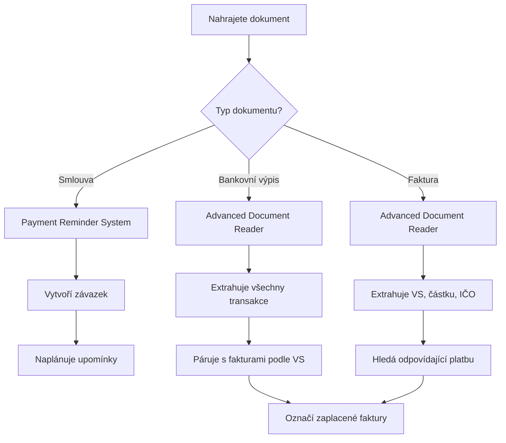

# 🎉 KOMPLETNÍ FINANČNÍ SYSTÉM V PAPERLESS-NGX

## ✅ Úspěšně nainstalované komponenty

### 1. 💰 **Payment Reminder System**
- **Status**: ✅ AKTIVNÍ
- **Funkce**:
  - Automatické vytváření závazků ze smluv
  - Upomínky 7 dní, 1 den před a v den splatnosti
  - Sledování výpovědních lhůt
  - Párování plateb podle VS

### 2. 🏦 **Multi-Bank Integration (5 bank)**
- **Status**: ✅ PŘIPRAVENO (čeká na konfiguraci)
- **Podporované banky**:
  - 🟣 Revolut Business (API)
  - 🟢 N26 (automatická synchronizace)
  - 🔵 ČSOB (email/API)
  - 🟡 Komerční banka (Selenium/MultiCash)
  - 🔴 Raiffeisenbank (Selenium)

### 3. 💳 **Spendee Premium Integration**
- **Status**: ⏸️ PŘIPRAVENO (lokálně, čeká na aktivaci)
- **Funkce**:
  - Import transakcí ze všech Spendee peněženek
  - Zachování kategorií
  - Automatické tagování

### 4. 📄 **Advanced Document Reader**
- **Status**: ✅ AKTIVNÍ
- **Funkce**:
  - Exaktní čtení bankovních výpisů (5 bank)
  - Extrakce všech dat z faktur
  - Rozpoznávání IČO, VS, částek
  - OCR pro skenované dokumenty
  - Automatické párování plateb

## 🔧 Jak systém funguje

### Automatický workflow:



### Denní procesy:
- **09:00** - Kontrola upomínek, generování notifikací
- **10:00** - Párování plateb (reconciliation)
- **08:00 & 20:00** - Synchronizace bank (pokud aktivní)
- **1. den v měsíci** - Měsíční finanční report

## 📊 Co systém extrahuje

### Z bankovních výpisů:
- ✅ Číslo účtu a období
- ✅ Všechny transakce (datum, částka, VS, popis)
- ✅ Počáteční a konečný zůstatek
- ✅ Automatické rozpoznání banky

### Z faktur:
- ✅ Číslo faktury a datum splatnosti
- ✅ Celková částka k úhradě
- ✅ Variabilní symbol (VS)
- ✅ IČO dodavatele a odběratele (správně oddělené!)
- ✅ Jednotlivé položky faktury

## 🚀 Rychlý start

### 1. Paperless API Token (pokud ještě nemáte):
```bash
# http://localhost:8050 → Admin → Auth Tokens → Create
```

### 2. Aktivace bank (volitelné):
```bash
# Revolut Business
./setup_revolut.sh

# N26
./setup_n26.sh

# ČSOB
./setup_csob.sh
```

### 3. Aktivace Spendee (volitelné):
```bash
./setup_spendee.sh
```

## 📋 Užitečné příkazy

### Kontrola systému:
```bash
# Seznam aktivních bank
docker exec paperless-ngx python3 /usr/src/paperless/scripts/banks/bank_manager.py list

# Test upomínek
docker exec paperless-ngx python3 /usr/src/paperless/scripts/payment_reminder_system.py scan_reminders

# Manuální párování plateb
docker exec paperless-ngx python3 /usr/src/paperless/scripts/integrate_document_reader.py reconcile
```

### Logy:
```bash
# Post-consume log
docker exec paperless-ngx tail -f /usr/src/paperless/data/reminders/post_consume.log

# Denní reconciliation
docker exec paperless-ngx tail -f /usr/src/paperless/data/reconciliation.log

# Bank sync (pokud aktivní)
docker exec paperless-ngx tail -f /usr/src/paperless/data/bank_sync.log
```

## 🎯 Co můžete dělat hned teď

1. **Nahrajte smlouvu** → systém vytvoří závazek a upomínky
2. **Nahrajte fakturu** → systém extrahuje všechna data
3. **Nahrajte bankovní výpis** → systém najde všechny transakce
4. **Zkontrolujte párování** → systém automaticky spáruje platby

## 📈 Přínosy systému

### Okamžité:
- ✅ Nikdy nezmeškáte platbu
- ✅ Automatické párování plateb
- ✅ Přehled všech závazků

### Po měsíci používání:
- 💰 Identifikace zbytečných poplatků
- 📊 Přehled cash flow
- 🎯 Možnosti úspor
- 📈 Kompletní finanční přehled

## 🔒 Bezpečnost

- Všechna data zůstávají ve vašem Paperless
- API tokeny jsou bezpečně uloženy
- Bankovní přístupy (pokud použity) jsou šifrovány
- Žádná data neopouštějí váš server

## 🆘 Troubleshooting

### Dokument se nezpracoval:
1. Zkontrolujte log: `/usr/src/paperless/data/reminders/post_consume.log`
2. Ověřte, že dokument obsahuje text (ne jen sken)
3. Pro skeny se ujistěte, že OCR funguje

### Platba se nespárovala:
1. Zkontrolujte, zda faktura i výpis mají stejný VS
2. Ověřte, že částky se shodují (tolerance 0.01 Kč)
3. Spusťte manuální reconciliation

### Banka se nesynchronizuje:
1. Zkontrolujte konfiguraci banky
2. Ověřte přihlašovací údaje
3. Zkontrolujte log: `/usr/src/paperless/data/bank_sync.log`

## 🎉 Gratulujeme!

Máte nyní **nejpokročilejší systém správy financí** integrovaný přímo v Paperless-ngx!

Systém bude automaticky:
- 📋 Sledovat všechny závazky
- 🔔 Upomínat na platby
- 🔍 Číst a analyzovat dokumenty
- 🔗 Párovat platby s fakturami
- 📊 Generovat finanční přehledy

**Užijte si automatizaci!** 🚀