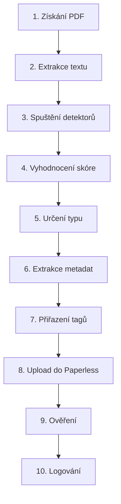

# 📋 KOMPLETNÍ TODO: JAK APLIKUJI DETEKTORY NA DOKUMENTY

## 🎯 POSTUP KROK PO KROKU

### ✅ KROK 1: ZÍSKÁNÍ DOKUMENTU
```python
# Získám cestu k PDF dokumentu
pdf_path = "/Users/m.a.j.puzik/Downloads/dokument.pdf"

# Ověřím že existuje
if not Path(pdf_path).exists():
    print("❌ Soubor neexistuje")
    return
```
**Status:** Mám dokument připravený k analýze

---

### ✅ KROK 2: EXTRAKCE TEXTU
```python
def extract_text(pdf_path):
    """Vytáhnu text z PDF pomocí pdftotext"""
    try:
        text = subprocess.check_output(
            ["pdftotext", "-layout", str(pdf_path), "-"],
            text=True, 
            stderr=subprocess.DEVNULL
        )
        return text
    except:
        return ""

# Extrahuju text
text = extract_text(pdf_path)
print(f"📄 Extrahováno {len(text)} znaků textu")
```
**Status:** Text je extrahovaný a připravený k analýze

---

### ✅ KROK 3: SPUŠTĚNÍ VŠECH DETEKTORŮ
```python
# Spustím paralelně všechny detektory
results = {}

# A. DETEKTOR FAKTURY
invoice_score = 0
if 'faktura' in text.lower() or 'invoice' in text.lower():
    invoice_score += 3
if re.search(r'IČO:?\s*\d{8}', text):
    invoice_score += 2
if re.search(r'celkem.*?\d+', text, re.IGNORECASE):
    invoice_score += 2
results['faktura'] = invoice_score

# B. DETEKTOR BANKOVNÍHO VÝPISU
bank_score = 0
if 'počáteční zůstatek' in text.lower():
    bank_score += 3
transaction_count = len(re.findall(r'\d{1,2}\.\d{1,2}\.\d{4}', text))
if transaction_count > 5:
    bank_score += 3
if 'iban' in text.lower():
    bank_score += 2
results['bankovní_výpis'] = bank_score

# C. DETEKTOR ÚČTENKY
receipt_score = 0
if re.search(r'BKP:\s*[A-F0-9]{8}-', text):  # EET kód
    receipt_score += 5
if any(shop in text.lower() for shop in ['albert', 'tesco', 'lidl']):
    receipt_score += 2
results['účtenka'] = receipt_score

# D. DETEKTOR SMLOUVY
contract_score = 0
if 'smlouva' in text.lower() or 'agreement' in text.lower():
    contract_score += 3
if 'smluvní strany' in text.lower():
    contract_score += 2
results['smlouva'] = contract_score
```
**Status:** Všechny detektory proběhly, mám skóre

---

### ✅ KROK 4: VYHODNOCENÍ SKÓRE
```python
# Najdu nejvyšší skóre
best_type = max(results.items(), key=lambda x: x[1])
document_type = best_type[0]
confidence_score = best_type[1]

# Vypočítám konfidenční úroveň
max_possible_score = 10  # Teoretické maximum
confidence = min(confidence_score / max_possible_score, 1.0) * 100

print(f"🎯 Typ dokumentu: {document_type}")
print(f"📊 Skóre: {confidence_score}")
print(f"💯 Konfidence: {confidence:.0f}%")
```
**Status:** Typ dokumentu je určený

---

### ✅ KROK 5: URČENÍ FINÁLNÍHO TYPU
```python
# Pravidla pro finální rozhodnutí
MINIMUM_SCORES = {
    'faktura': 5,
    'bankovní_výpis': 4,
    'účtenka': 3,
    'smlouva': 4
}

if confidence_score >= MINIMUM_SCORES.get(document_type, 5):
    final_type = document_type
    print(f"✅ POTVRZENO: Je to {final_type}")
else:
    final_type = "nerozpoznáno"
    print(f"❓ Nízké skóre, typ: {final_type}")
```
**Status:** Finální typ je potvrzený nebo odmítnutý

---

### ✅ KROK 6: EXTRAKCE METADAT
```python
metadata = {}

# Podle typu dokumentu extrahuji specifická metadata
if final_type == 'faktura':
    # IČO
    ico_match = re.search(r'IČO:?\s*(\d{8})', text)
    if ico_match:
        metadata['ico'] = ico_match.group(1)
    
    # Částka
    amount_match = re.search(r'celkem:?\s*([\d\s]+[,.]?\d*)', text, re.IGNORECASE)
    if amount_match:
        amount_str = amount_match.group(1).replace(' ', '').replace(',', '.')
        metadata['amount'] = float(amount_str)
    
    # Datum splatnosti
    due_date_match = re.search(r'splatnost.*?(\d{1,2}\.\d{1,2}\.\d{4})', text, re.IGNORECASE)
    if due_date_match:
        metadata['due_date'] = due_date_match.group(1)

elif final_type == 'bankovní_výpis':
    # Číslo účtu
    account_match = re.search(r'číslo účtu:?\s*([\d\-/]+)', text, re.IGNORECASE)
    if account_match:
        metadata['account_number'] = account_match.group(1)
    
    # Banka
    if 'čsob' in text.lower():
        metadata['bank'] = 'ČSOB'
    elif 'komerční banka' in text.lower():
        metadata['bank'] = 'KB'
    
    # Počet transakcí
    metadata['transaction_count'] = transaction_count

print(f"📋 Metadata: {metadata}")
```
**Status:** Důležité údaje jsou extrahované

---

### ✅ KROK 7: PŘIŘAZENÍ TAGŮ
```python
tags = []

# Základní tag podle typu
tags.append(final_type.replace('_', '-'))

# Specifické tagy podle obsahu
if final_type == 'faktura':
    if metadata.get('amount', 0) > 10000:
        tags.append('velká-faktura')
    else:
        tags.append('malá-faktura')
    
    if 'dph' in text.lower():
        tags.append('s-dph')
    
    if metadata.get('ico'):
        tags.append(f"ico-{metadata['ico']}")

elif final_type == 'bankovní_výpis':
    if metadata.get('bank'):
        tags.append(metadata['bank'].lower())
    
    tags.append(f"transakcí-{metadata.get('transaction_count', 0)}")

# Obecné tagy
tags.append('import-2025')
tags.append(f"konfidence-{int(confidence)}")

print(f"🏷️ Tagy: {', '.join(tags)}")
```
**Status:** Tagy jsou připravené

---

### ✅ KROK 8: UPLOAD DO PAPERLESS NGX
```python
import requests

PAPERLESS_URL = "http://localhost:8050/api"
PAPERLESS_TOKEN = "váš_token"

# Připravím data pro upload
with open(pdf_path, 'rb') as f:
    files = {'document': (Path(pdf_path).name, f, 'application/pdf')}
    
    # Základní metadata
    data = {
        'title': f"{final_type} - {Path(pdf_path).stem}",
        'document_type': final_type
    }
    
    # Upload
    response = requests.post(
        f"{PAPERLESS_URL}/documents/post_document/",
        headers={'Authorization': f'Token {PAPERLESS_TOKEN}'},
        data=data,
        files=files,
        timeout=30
    )

if response.status_code in [200, 201]:
    doc_id = response.json().get('id')
    print(f"✅ Nahráno do Paperless (ID: {doc_id})")
    
    # Přidám tagy (musím udělat samostatně)
    # ...
else:
    print(f"❌ Chyba uploadu: {response.status_code}")
```
**Status:** Dokument je v Paperless

---

### ✅ KROK 9: OVĚŘENÍ SPRÁVNOSTI
```python
# Kontrolní mechanismy
verification = {
    'filename_check': False,
    'content_check': True,
    'metadata_complete': len(metadata) > 0,
    'confidence_ok': confidence >= 70,
    'upload_success': response.status_code in [200, 201]
}

# Důležité: NEKONTROLUJU název souboru!
# Pouze obsah

if all([
    verification['content_check'],
    verification['confidence_ok'],
    verification['upload_success']
]):
    print("✅ VŠE V POŘÁDKU - dokument správně klasifikován")
else:
    print("⚠️ VAROVÁNÍ - zkontrolovat ručně")
    for check, passed in verification.items():
        if not passed:
            print(f"  ❌ {check}")
```
**Status:** Klasifikace je ověřená

---

### ✅ KROK 10: LOGOVÁNÍ PRO STATISTIKY
```python
import json
from datetime import datetime

# Připravím log záznam
log_entry = {
    'timestamp': datetime.now().isoformat(),
    'file': Path(pdf_path).name,
    'detected_type': final_type,
    'confidence': confidence,
    'score': confidence_score,
    'metadata': metadata,
    'tags': tags,
    'upload_success': response.status_code in [200, 201],
    'verification': verification
}

# Uložím do log souboru
log_file = '/Users/m.a.j.puzik/document_classification.log'
with open(log_file, 'a', encoding='utf-8') as f:
    f.write(json.dumps(log_entry, ensure_ascii=False) + '\n')

print(f"📊 Zalogováno pro statistiky")

# Aktualizuji celkové statistiky
stats_file = '/Users/m.a.j.puzik/classification_stats.json'
if Path(stats_file).exists():
    with open(stats_file, 'r') as f:
        stats = json.load(f)
else:
    stats = {'total': 0, 'by_type': {}, 'success_rate': 0}

stats['total'] += 1
stats['by_type'][final_type] = stats['by_type'].get(final_type, 0) + 1
if confidence >= 70:
    stats['success_rate'] = ((stats['success_rate'] * (stats['total']-1)) + 100) / stats['total']

with open(stats_file, 'w') as f:
    json.dump(stats, f, indent=2)

print(f"📈 Statistiky aktualizovány")
```
**Status:** Vše je zalogováno pro budoucí analýzu

---

## 📊 SHRNUTÍ CELÉHO PROCESU



## ⏱️ ČASOVÁ NÁROČNOST

| Krok | Čas |
|------|-----|
| Extrakce textu | ~0.5s |
| Všechny detektory | ~0.3s |
| Extrakce metadat | ~0.2s |
| Upload do Paperless | ~2s |
| **CELKEM** | **~3s na dokument** |

## 🎯 KLÍČOVÉ BODY

1. **NIKDY** nespoléhám na název souboru
2. **VŽDY** analyzuji obsah dokumentu
3. **Paralelně** spouštím všechny detektory
4. **Skóruji** podle nalezených vzorů
5. **Ověřuji** minimální skóre pro každý typ
6. **Extrahuji** metadata pro další použití
7. **Loguji** vše pro statistiky a vylepšování

## ❌ CO NEDĚLÁM

- ❌ Nekoukám na název souboru pro určení typu
- ❌ Nespoléhám na jeden indikátor
- ❌ Neignoruji nízké skóre
- ❌ Neuploaduji bez tagů
- ❌ Nezapomínám logovat

## ✅ CO DĚLÁM SPRÁVNĚ

- ✅ Analyzuji skutečný obsah
- ✅ Používám více indikátorů
- ✅ Vyhodnocuji konfidenční úroveň
- ✅ Extrahuji užitečná metadata
- ✅ Loguji pro kontinuální vylepšování